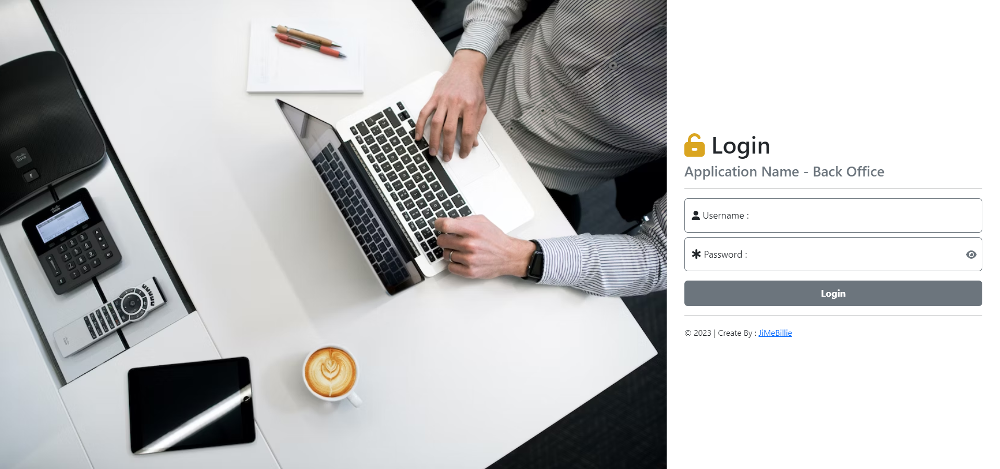
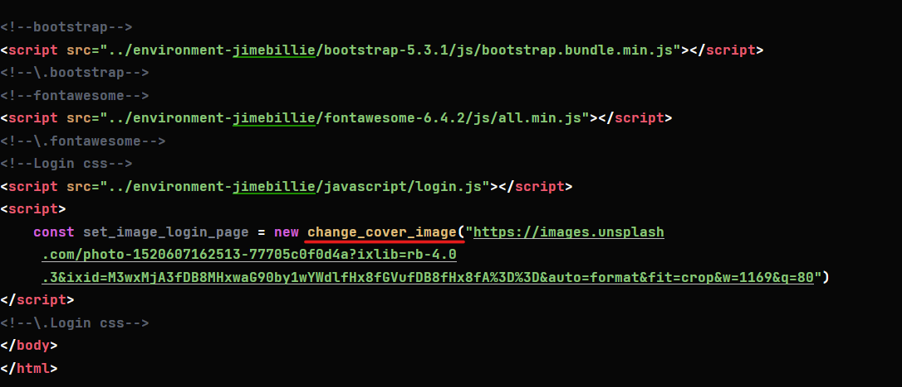

# Template-Admin
> ***Template-Admin คือ ?*** ---  เป็น Template HTML สำหรับ ระบบหลังบ้าน โดยพัฒนาด้วย HTML, CSS, JavaScript เพื่อลดระยะเวลาในการ Dev และได้ Focus กับงานมากกว่า

## Environment
* ไฟล์ที่จำเป็น
> - environment-jimebillie/bootstrap-5.3.1
> - environment-jimebillie/fontawesome-6.4.2
> - environment-jimebillie/css
> - environment-jimebillie/javascript

## Page
> ไฟล์ Page ต่าง ๆ จะอยู่ใน Folder page เป็นไฟล์ .HTML

## login

> **หากต้องการเปลี่ยนรูป Cover ของหน้า login**
> 
> * ให้เปลี่ยนที่ส่วนล่างของ Tag Script ที่ Object : "change_cover_image" โดยคัดลอกที่อยู่ภาพมาวางได้เลย
> 
